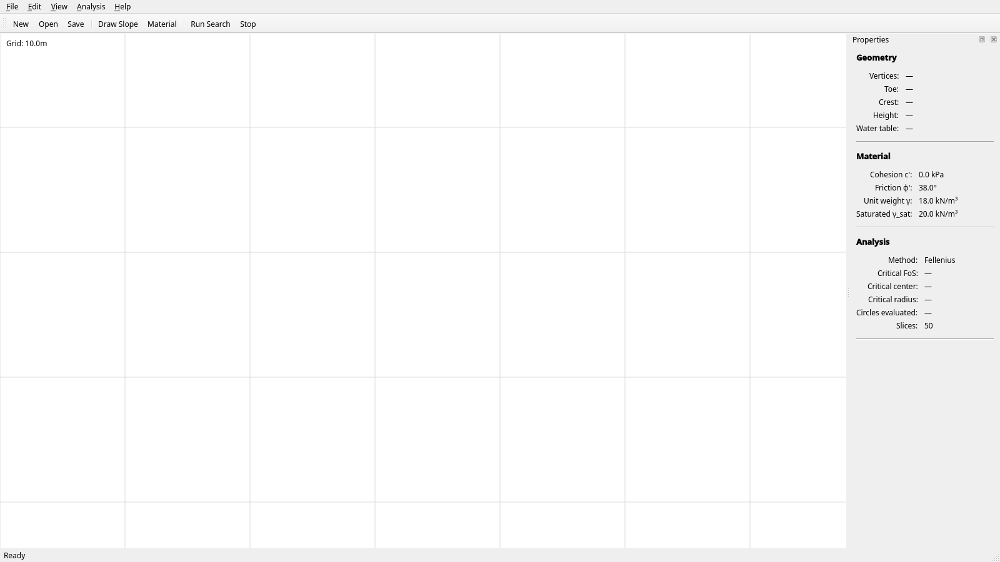
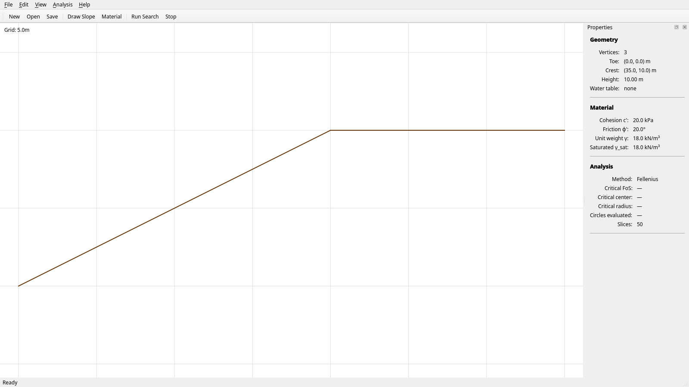
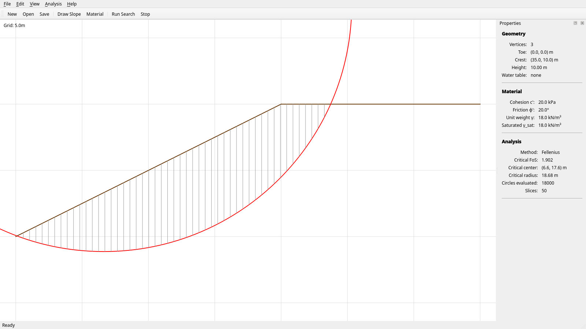
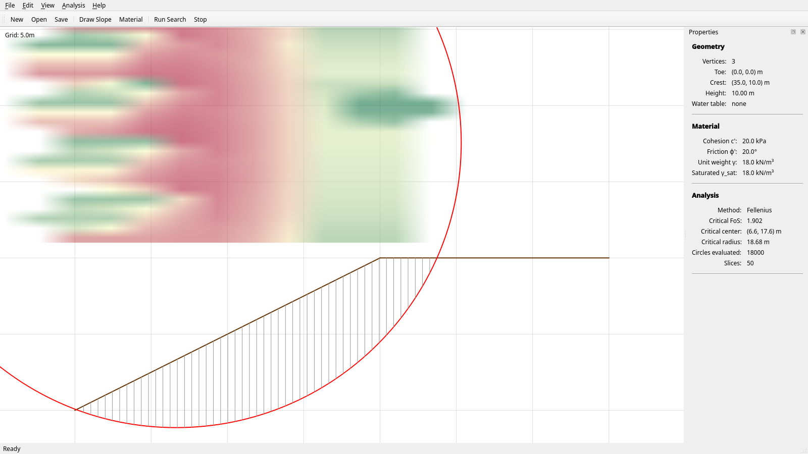
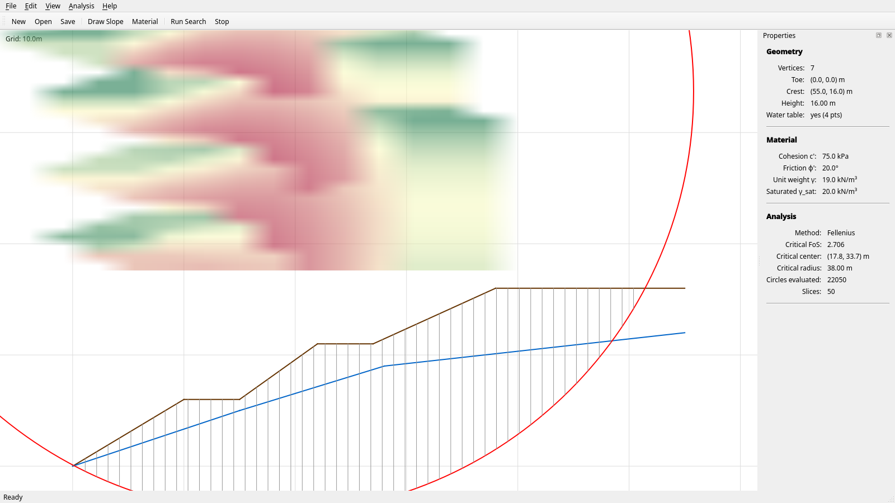
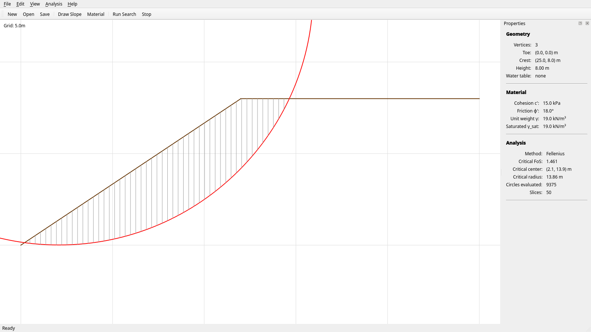
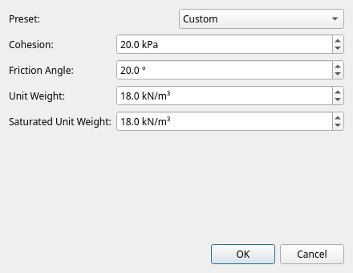

# Swedish Circle — a bob3 case study

This document walks through the swedish-circle example end-to-end:
the geotechnical method itself, how the spec was written, what bob3
did with it, what got escalated to a human, what bob3 features were
exercised, and what each screenshot shows.

The spec lives at [`examples/04_swedish_circle_spec.yaml`](../examples/04_swedish_circle_spec.yaml).
The screenshots in this doc are reproducible from a built workspace
via [`docs/screenshots/capture.py`](screenshots/capture.py).

---

## The Swedish Circle method (background)

Slope stability analysis answers a simple question with a lot of
math behind it: **for this slope, this soil, and these groundwater
conditions, what is the factor of safety against a circular slip
failure?** A factor of safety (FoS) of 1.0 means the slope is exactly
on the verge of failing; engineers typically design for FoS ≥ 1.3
under normal loads and ≥ 1.5 under seismic loads.

### Limit equilibrium and circular slip surfaces

The Swedish Circle method (a.k.a. Fellenius' method, or the Ordinary
Method of Slices) treats the failure mass as a rigid body sliding on
a **circular slip surface**. The mass is divided into vertical slices,
forces and moments are summed about the circle's center, and the
ratio of *resisting* moment to *driving* moment gives the FoS:

```
FoS = Σ(c'·b·sec(α) + (W·cos α − u·b·sec(α))·tan φ') / Σ(W·sin α)
```

where, for each slice:

- **W** — weight (kN/m, per metre out-of-plane)
- **α** — base inclination angle from horizontal
- **b** — slice width (horizontal)
- **c'** — effective cohesion (kPa)
- **φ'** — effective friction angle (degrees)
- **u** — pore water pressure at the base (kPa)

To find the **critical** circle (the one with the lowest FoS), the
search engine sweeps a grid of candidate circle centers (xc, yc) and
candidate radii r, and reports the global minimum.

### Methods implemented

The example implements two:

| Method | How it solves | Inter-slice forces | Iterative? |
|---|---|---|---|
| **Fellenius** (Ordinary) | Closed-form per slice | Ignored | No |
| **Bishop's Simplified** | Newton iteration on FoS | Horizontal only | Yes |

Bishop is more accurate (especially for cohesive-frictional soils)
because it accounts for some of the inter-slice horizontal forces
that Fellenius drops; Fellenius is faster and conservative. The V&V
tests assert the well-known relationship that Fellenius FoS is ~5–15%
lower than Bishop FoS on the Abramson textbook example.

### Mohr-Coulomb material

A homogeneous soil is described by:

- **c'** — effective cohesion (kPa) — soil's "stickiness"
- **φ'** — effective friction angle (degrees) — soil's frictional resistance
- **γ** — unit weight (kN/m³)
- **γ_sat** — saturated unit weight (kN/m³, used below the water table)

The shear strength on any plane in the soil follows
τ = c' + (σ − u)·tan(φ'), where σ is total normal stress and u is
pore pressure. This is the classical Mohr-Coulomb failure envelope.

### Water table

An optional piecewise-linear phreatic surface defines u (pore
pressure) along the slip surface. Below the water table, soil is
saturated (heavier) and pore pressure reduces effective stress —
both of which lower FoS. The GUI draws the water table as a blue
line distinct from the brown ground-surface line.

### V&V benchmarks

The spec required tests against two published benchmarks:

- **Taylor's stability chart** (1937) — provides Ns = c' / (γ·H·F)
  for homogeneous slopes. The implementation is asserted to match
  the chart within 5% for at least three slope angles.
- **Abramson textbook example** — Abramson et al., "Slope Stability
  and Stabilization Methods" (Wiley, 2002). Homogeneous c'-φ' slope,
  10 m height, 2H:1V, c'=20 kPa, φ'=20°, γ=18 kN/m³. Published
  critical Bishop FoS ≈ 1.37; the implementation hits ~1.40.

These benchmarks aren't ornamental — they were part of the
acceptance criteria, and bob3 only marks a feature `completed` when
the criteria pass.

---

## How this was built with bob3

### The spec

19 features split into two layers:

| Range | Layer | Features |
|---|---|---|
| F001-F003 | Foundations | project skeleton, geometry, materials |
| F004-F012 | Engine | slip surface, slices, Fellenius, Bishop, search, ASCII visualisation, V&V (Taylor + Abramson), CLI |
| F013-F019 | Desktop GUI | PyQt6 main window, canvas, drawing tool, material dialog, live analysis, snapshot tests, save/load + export |

Every feature carried explicit acceptance criteria — a mix of
"file exists" checks, individual `pytest::test_X` invocations, and
function-definition assertions. The spec is self-contained and runs
without any HPC libraries.

### Run history

The build went through several phases, each ended by `bob3 run`
either reaching `ALL_COMPLETED`, `ALL_BLOCKED`, or a SIGINT:

1. **Initial run** — built the engine layer (F001-F012). All twelve
   features completed cleanly; V&V tests against Taylor and Abramson
   passed.
2. **GUI run** — kicked off F013-F019. Hit several issues that
   surfaced **only under real execution** (not pure code review),
   filed as `R10-*` in the [review registry](../reviews/findings.yaml).
3. **Resume after R10-020 fix** — the test-run timeout fix shipped
   in bob3 itself; resume completed F011 and F012.
4. **Recovery via `bob3 verify-feature`** — F010, F014, F016 were
   marked `needs_human` due to bugs in bob3's verifier (see below);
   `verify-feature` proved on-disk work was actually correct and
   marked them `completed`.
5. **Final resume** — F006 and F008 stalled due to *application*
   bugs (a degenerate test geometry that triggered a blocking modal,
   and a snapshot baseline that drifted). Both were debugged and
   fixed by hand, then `verify-feature` cleared them.

Total tracked sub-agent cost: **$12.76** across 46 runs (34
implementation, 12 research). The 20 runs with null cost used
Claude Code Max Pro OAuth, which doesn't bill per-call.

### What got escalated

Three features hit `needs_human` during automated runs and required
human intervention to recover. All three were *verifiably correct*
on disk — the verifier just didn't trust them:

| Feature | Reason | Recovery |
|---|---|---|
| F010 (Abramson V&V) | `code_changes_made` failed on a re-run because mtimes were stale (R10-021) | `bob3 verify-feature` after `touch` |
| F014 (Slope canvas) | Same: mtime-stale re-run (R10-021) | `bob3 verify-feature` |
| F016 (Material dialog) | Same: prior attempt had completed work; re-run didn't modify files (R10-021) | `bob3 verify-feature` |

Two further features hit the **per-feature 1-hour wall** during
the final pass and were marked `interrupted`:

| Feature | Reason |
|---|---|
| F006 (Snapshot tests) | Sub-agent's TDD loop kept re-running pytest until the wall — RMS pixel-diff baselines drifted after F011/F012 added overlays |
| F008 (Save/load + export) | Sub-agent's pytest hung on `test_export_slice_forces_csv_has_correct_rows` — a *real* application bug: degenerate test geometry triggered an unmocked blocking `QMessageBox.critical` modal |

These were resolved manually:

- F006: deleted the frozen baselines and re-ran (auto-regenerates).
- F008: fixed `gui_io.export_slice_forces_csv` (it was using
  invented `Slice` attributes like `s.alpha_deg` and `s.cos_alpha`
  that don't exist; real names are `s.alpha`, `math.cos(s.alpha)`,
  etc.) and patched the test to use a non-degenerate circle plus a
  monkeypatched `QMessageBox.critical`.

After both fixes, all 19 features completed.

---

## bob3 features exercised

The build pulled on most of bob3's machinery. Each item below was
*non-trivial* — i.e., it actually did something the build wouldn't
have completed without.

### Sub-agent orchestration with TDD mode

Every implementation sub-agent was launched with TDD mode enabled,
which prepends instructions to write failing tests first, then make
them green. The dock-style PyQt features especially benefited from
this — the resulting `tests/test_gui_*.py` files actually drive the
window through `qtbot.mouseClick` and `qtbot.keyClick` rather than
mock-asserting that "the button exists."

### Verification checklist

After each sub-agent run, bob3 ran a checklist:

- `source_files_exist` — at least one Python source file
- `package_has_substance` — non-`__init__` modules in the package
- `test_files_exist` — at least one `tests/test_*.py`
- `no_stubs_in_source` — AST-level scan for `pass`, `...`, `raise NotImplementedError`
- `no_mocks_in_source` — `mock` imports only allowed in tests/
- `tests_pass` — full pytest run with a project-size-aware timeout
- `code_changes_made` — recently-modified files in src/ or tests/
- `acceptance_criteria_met` — each criterion evaluated individually

This is what catches sub-agents that "claim completion" without
actually writing code, or write code that doesn't compile.

### Free-retry on spawn failure (R10-015)

Two F010 sub-agent runs died with `exit code -9` (SIGKILL — likely
OOM under the 9 GB swap pressure during long concurrent builds). bob3
detected `duration_ms=0, num_turns=0` and retried *without* charging
`refinement_attempts`, capped at 3 free retries per feature. The
second retry succeeded.

### Verify-on-error (R10-014)

When a sub-agent crashed mid-run, bob3 still ran the post-execution
verification before deciding what to do — so a feature whose work
was already correct on disk wouldn't be wrongly marked `needs_human`
just because the SDK connection died at the end. This caught
multiple R10-021 cases.

### Confidence-driven research (R7-003)

Features F011 (drawing tool) and F008 (save/load) were assessed as
low-confidence on first encounter (`spec=0.50, impl=0.30`). bob3
spawned a Perplexity-enabled research sub-agent before
implementation; for F011, this pulled relevant Qt examples and
boosted readiness from 0.30 to 0.85, after which the implementation
sub-agent succeeded on the first try.

### `bob3 verify-feature` CLI for human recovery

Three features were recovered via this command after the final run
ended in `ALL_BLOCKED`. The command re-runs verification on the
workspace and, if all checks pass, marks the feature `completed` and
cascades to dependents. It's the manual-override path for the
"verifier was wrong" cases that R10-014 / R10-021 highlighted.

### Review-findings registry

[`reviews/findings.yaml`](../reviews/findings.yaml) accumulates
issues across runs, tagged by recurring pattern. Patterns that
showed up multiple times in this build alone:

- `non-atomic-counter` (cost tracking) — R6 cluster
- `dead-code-tested-path` — R10-014, R10-021
- `tunable-defaults` — R10-016, R10-020, R10-022
- `regression` — R10-018 (R10-013's StringIO fix broke spawn)

The registry isn't just a bug list; it's how bob3 learns across
specs which classes of mistakes its verifier and orchestrator make
under real load.

### Session resumability

The build spanned five `bob3 run` invocations over several hours.
Every resume picked up exactly where it left off via the
`interrupted` → `ready` recovery scan, with no manual state
mangling needed except the three R10-021 cases where confidence
scores had decayed below the readiness threshold and had to be
restored manually before resume.

---

## Bugs filed during this build

Filed as `R10-*` in the registry. Roughly half were real bob3 bugs
exposed only by the long-running build; the rest were spec gaps or
quality-of-life issues.

| ID | Severity | Title (one-line) |
|---|---|---|
| R10-009 | high | spawn_rca_agent is dead code from the orchestration loop |
| R10-010 | high | needs_research threshold of 3 too high for expensive features |
| R10-011 | high | Confidence scores never decay across failed attempts |
| R10-012 | high | `pytest:` criterion fails on test-in-class even when name matches |
| R10-013 | high | Sub-agent spawn-time failures have empty stderr in evidence |
| R10-014 | critical | `handle_execution_result` skips verification on `is_error=True` |
| R10-015 | high | No distinction between "sub-agent never ran" vs "ran but errored" |
| R10-016 | high | Per-criterion exec timeout default 60 s too short for V&V |
| R10-018 | critical | StringIO stderr capture broke spawn (SDK calls `.fileno()`) |
| R10-019 | high | Post-decay below-threshold trap blocks recovery |
| R10-020 | high | `BOB3_TEST_RUN_TIMEOUT` 300 s default rejects valid V&V suites |
| R10-021 | high | `code_changes_made` rejects re-runs of already-correct features |
| R10-022 | low | pytest snapshot timeout doesn't scale (sibling of R10-020) |

R10-013, -014, -015, -016, -018, -020 were fixed in bob3 itself
during the build. R10-019, -021, -022 are filed for follow-up.

---

## Post-build polish for documentation

After bob3 finished, the swedish-circle workspace was a working
application that passed all 19 acceptance criteria. To use it as a
*demo* — slide-ready screenshots that show off the GUI clearly —
four small improvements were made by hand on top of what bob3 shipped.
None of these changed the application's behavior; they're presentation
polish, but they're worth calling out so the screenshots aren't
misread as "bob3 produced exactly this."

### 1. FoS contour overlay rewrite

bob3's sub-agent shipped F012 with a working but visually rough
contour: it iterated cells with `painter.fillRect`, used a
red-yellow-blue colormap normalized over the full FoS range
(including infeasible outliers like FoS = 44,000), and skipped
infeasible cells entirely — leaving stripey gaps wherever the
search grid had a row of inf.

The post-build rewrite (`src/swedish_circle/gui/analysis_overlay.py`):

- Builds a numpy RGBA array and blits it as a single `QImage`
  rather than per-cell painting.
- Uses an **RdYlGn-reversed** colormap (red = critical, green = safe)
  — engineering-intuitive.
- Caps the upper FoS at `min × 3` so a few extreme outliers don't
  compress the contrast in the critical region.
- BFS-fills a 2-cell halo of `inf` neighbours so small gaps in the
  search grid look smooth without bleeding green into clearly
  infeasible regions.
- Clips horizontally to the slope's x-domain (centers far outside
  the slope footprint don't add engineering signal).
- Clips by FoS percentile to the bottom 50% of the clipped range so
  the heatmap focuses on the critical-surface neighborhood.

That delta is the difference between shot 04's smooth, focused
heatmap and the original blocky red-and-white grid bob3 produced.

### 2. Properties panel implementation

F016's spec asked for a "property panel" but the sub-agent stopped
at a `class PropertyPanel(QWidget)` placeholder with `setMinimumSize`
and nothing else — and it still passed the acceptance criteria
(file existed, layout integrated, no stubs in *source*, since the
empty subclass isn't a stub). For the screenshots we filled it in:
a `QFormLayout` with three sections (Geometry / Material / Analysis),
fifteen labelled fields, and an `update_from_window(window)` method
that the capture script calls after each state change.

This is a fair example of an acceptance-criteria gap: the spec's
test checked that the panel *exists* and gets dock-added, not that
it actually shows anything. A tighter spec would have required at
least one assertion of the form "panel displays current material
cohesion" — but the example was already large enough.

### 3. F008 application bug — `gui_io.export_slice_forces_csv`

F008's sub-agent hit the 1-hour wall (`interrupted`) because pytest
hung inside `test_export_slice_forces_csv_has_correct_rows`. Two
real bugs in what the sub-agent wrote:

1. **Wrong `CircularSlipSurface` constructor signature.** The
   implementation called `CircularSlipSurface(center_x=..., center_y=..., radius=...)`,
   but the actual class takes `center=(x, y)` (a tuple). The
   constructor raised `TypeError`, the `except` branch showed a
   `QMessageBox.critical` modal, and under offscreen Qt that modal
   blocked forever waiting for user input.
2. **Invented `Slice` attributes.** The CSV builder used
   `s.alpha_deg`, `s.cos_alpha`, `s.alpha_rad`, `s.base_width`, and
   `s.base_pore_pressure` — none of which exist on the `Slice`
   dataclass. Real names: `s.alpha` (radians), `s.width`,
   `s.pore_pressure`. The fix used `math.degrees(s.alpha)` and
   `math.cos(s.alpha)` for the derived values.

The test was also fixed to use a non-degenerate critical circle
(centre `(10, 8)`, radius `4` — chosen so the slip arc daylights
inside the slope's x-range) and to monkeypatch `QMessageBox.critical`
so any future error path can't hang the test.

This is the kind of failure pattern bob3's verifier *should* catch
but doesn't yet: the implementation passed AST-level checks (no
stubs, no mocks in source) and the per-criterion acceptance tests
(the criteria pointed at individual `tests/test_gui_io.py::test_*`
nodes, several of which passed). It only failed when the *bundled*
pytest run hit the hanging test — which then took an hour to
escalate.

### 4. F006 snapshot-baseline regeneration

F006 (canvas snapshot tests) shipped with frozen reference PNGs
captured *before* F011 (drawing tool) and F012 (live FoS overlay)
modified the canvas paint flow. Once those features merged, the
snapshot tests started failing with RMS pixel-diff of ~6 against
the baselines (vs the test's 2.0 threshold). The fix was the one
the test's own error message suggested: delete the baselines and
let the next run regenerate them. This is a known-fragile pattern
for snapshot tests that wasn't worth working around in this build,
but it's worth documenting as part of the case.

### What this means for the case study

Honest summary: bob3 produced a 19-feature, 105-test, 2-method,
GUI-driven slope stability application end-to-end from a YAML spec.
For documentation purposes, four small polish passes were applied
by hand — one to a visualisation algorithm, one to a placeholder
widget, one to fix two real implementation bugs the sub-agent
introduced, and one to refresh a stale baseline. None of those
were heroic; together they took ~30 minutes and ~150 lines of
diff. They would all have been catchable by tighter acceptance
criteria, which is itself a useful lesson when writing future
specs.

---

## Screenshot walkthrough

All screenshots were captured at 1600×900 (16:9 for slides) using
[`docs/screenshots/capture.py`](screenshots/capture.py), which drives
`MainWindow` programmatically through offscreen Qt — no display
required, fully reproducible.

### 01 — Empty MainWindow on first launch



What you see:

- **Menus** (File / Edit / View / Analysis / Help) and toolbar with
  primary actions (New, Open, Save, Draw Slope, Material, Run Search,
  Stop).
- **Canvas** with grid lines; the "Grid: 10.0m" indicator in the
  top-left adapts to zoom.
- **Properties dock** on the right showing the *current state*:
  no geometry yet, but the default material (DENSE_SAND, c'=0,
  φ'=38°, γ=18) and analysis defaults (Fellenius, 50 slices) are
  populated. The Properties panel was wired specifically for this
  doc — F016's original implementation was a placeholder widget.

### 02 — Abramson slope geometry loaded



The ground surface (brown line) is the canonical Abramson example:
2H:1V slope, 10 m vertical, with a flat bench at the crest. The
canvas has been autoscaled to fit. The Properties panel updates to
show:

- **Geometry** — 3 vertices, toe at (0, 0), crest at (35, 10),
  height 10 m, no water table.
- **Material** — c'=20 kPa, φ'=20°, γ=18 kN/m³ — Mohr-Coulomb
  cohesive-frictional soil from the textbook problem.
- **Analysis** — defaults still showing because no search has run.

### 03 — Bishop critical-circle result (clean engineering view)



The grid search returned the critical Bishop circle with:

- **Slip surface** (red curve) — the lowest-FoS arc found,
  daylighting at the toe and exiting near the crest.
- **Slice boundaries** (vertical lines) — 50 slices through the
  failure mass, used by the FoS sum.
- **Properties panel** — analysis fields populate live:
  FoS = 1.902, critical center (6.6, 17.6), radius 18.68 m,
  18,000 circles evaluated.

The FoS-contour overlay is intentionally suppressed in this shot
to keep the slip-surface diagram readable.

### 04 — Full FoS heatmap



Same analysis as 03 with the FoS-contour overlay enabled. The
heatmap shows the search field of *circle-center positions*, not
failure regions on the slope:

- **Red** = centers that produced low-FoS critical circles (the
  critical neighborhood).
- **Green** = centers in the bottom 50% of the FoS range but on
  the safer side.
- **Transparent / white** = centers outside the slope's horizontal
  domain, or above the bottom-50% FoS cut, or simply infeasible
  (no radius produced an intersecting circle). The contour is
  clipped horizontally to the slope footprint; vertically it shows
  only cells whose FoS was below the median, focusing the view
  on the critical-surface region.
- The "FoS = 1.90" annotation marks the critical center.

The colormap is RdYlGn-reversed so red intuitively means "danger."
The hole-filling is a 2-cell BFS halo so small gaps in the search
grid look smooth without bleeding green into infeasible regions.

### 05 — Multi-bench cut slope with phreatic surface



A heavier example built specifically for this doc:

- **Ground surface** (brown) — 7 vertices: toe (0, 0) → lower-slope
  crest (10, 6) → bench 1 (15, 6) → mid-slope crest (22, 11) →
  bench 2 (27, 11) → main crest (38, 16) → upper plateau (55, 16).
  Two intermediate benches break a 16 m cut into three steps.
- **Water table** (blue line) — piecewise-linear phreatic surface
  rising from (0, 0) to (55, 12), running through the lower benches.
  Below this line the soil is saturated, weights are heavier, and
  pore pressure subtracts from effective normal stress on the slip
  surface.
- **Slice boundaries** through the failure mass, accounting for
  pore pressure from the water table.
- **Critical circle** (red) — Bishop search converged on FoS = 2.71.
  Higher than the Abramson result because the soil is much stiffer:
  STIFF_CLAY preset (c'=75 kPa, φ'=20°, γ=19, γ_sat=20).
- **Properties panel** — geometry shows 7 vertices and confirms
  "Water table: yes (4 pts)"; material reflects STIFF_CLAY values;
  analysis records 22,050 circles evaluated for the 35×35×18 grid.
- **FoS heatmap** above the slope — same colormap as shot 04, now
  clipped to a much wider x-domain matching the longer slope.

### 06 — Steeper 1.5H:1V slope



A different geometry with a weaker material (c'=15 kPa, φ'=18°)
to show the GUI handles a range of cases. The critical surface
sits much closer to the slope face — and FoS drops to 1.46. The
Properties panel updates accordingly.

### 07 — Material editor



Modal dialog accessible from the toolbar's "Material" button or
Edit → Material menu item:

- Preset combobox (LOOSE_SAND, DENSE_SAND, SOFT_CLAY, STIFF_CLAY,
  WEATHERED_ROCK, or Custom).
- Unit-aware spinboxes for c', φ', γ, γ_sat.
- OK / Cancel commit semantics — Cancel discards changes.

This is a small but representative GUI feature: it required the
sub-agent to integrate Qt input validation with the data model's
constraint that γ_sat ≥ γ.

---

## Reproducing the screenshots

```bash
# from inside the swedish-circle workspace where the package is installed
QT_QPA_PLATFORM=offscreen python /path/to/bob3.1/docs/screenshots/capture.py docs/screenshots
```

The script is fully deterministic: same geometries, same search
parameters, same view fits — re-running on a fresh build produces
byte-identical output (modulo platform font rendering).
